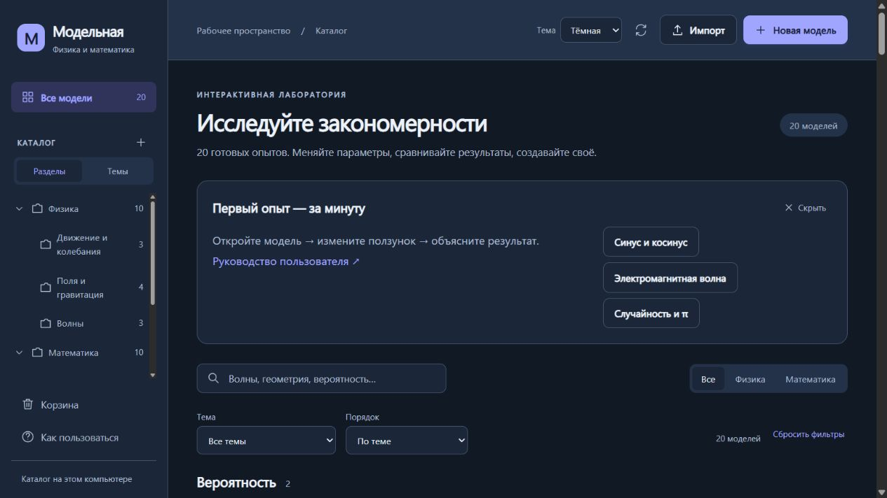

# Модельная

[](https://github.com/sashasychev05-sketch/model-studio/actions/workflows/check.yml)
[](https://github.com/sashasychev05-sketch/model-studio/releases/latest)

Локальная интерактивная лаборатория по физике и математике. **20 готовых моделей**, редактор собственных опытов, анализ CSV, подбор параметров, анимация, шесть общих тем, включая чёрную и экспорт демонстраций для работы без интернета.

**Актуальный выпуск — [2.3.1 от 9 октября 2026](https://github.com/sashasychev05-sketch/model-studio/releases/tag/v2.3.1).** Отдельное приложение, русский установщик, обновления с подтверждением, сохранение анализа и резервные копии библиотеки.

**В этой ветке подготовлен черновик 2.4.0:** настройки за шестерёнкой, полный экран, перенос старой библиотеки, улучшенный импорт таблиц и HTML с инструкцией для ученика. [Описание и проверки](docs/VERSION-2.4.md) · [Предложения по расширению редактора](docs/EDITOR-NEXT.md). Публичный установщик ниже относится к стабильной версии 2.3.1.



## Отдельное приложение для Windows

**[Скачать установщик 2.3.1 для Windows x64](https://github.com/sashasychev05-sketch/model-studio/releases/download/v2.3.1/ModelStudio-Setup-2.3.1-x64.exe)** · [Все выпуски](https://github.com/sashasychev05-sketch/model-studio/releases/latest)

Установите приложение для текущего пользователя. Браузер, терминал и установка Node.js не нужны. Кнопка **Проверить обновления** предлагает скачать новую версию и установить её после отдельного подтверждения. Модели и анализ сохраняются отдельно от папки программы. Текущий установщик не подписан сертификатом Windows; подробности — в инструкции ниже.

ZIP-сборка доступна в разделе **Artifacts → ModelStudio-Windows-x64** успешного [запуска GitHub Actions](https://github.com/sashasychev05-sketch/model-studio/actions/workflows/check.yml) (для скачивания нужен вход в GitHub). Распакуйте архив целиком и откройте ModelStudio.exe. Для обновлений внутри приложения нужен переход на установленную версию.

Ученикам достаточно отдельного HTML: **Экспорт → Готовая демонстрация · HTML**. Он открывается без приложения и без интернета.

[Запуск, сохранение анализа, резервная копия и перенос данных](docs/DESKTOP.md).

## Запустить исходную версию в браузере

1. Установите **Node.js 22.13 или новее** с [nodejs.org](https://nodejs.org/).
2. Скачайте репозиторий: **Code → Download ZIP**, распакуйте в обычную папку.
3. В Windows запустите **ЗАПУСТИТЬ-В-БРАУЗЕРЕ.cmd**. На любой системе откройте терминал в папке приложения и выполните:

```sh
node server.mjs
```

4. Откройте **http://127.0.0.1:4189/**. Терминал должен оставаться открытым. Остановка: Ctrl+C.

Научные библиотеки включены локально: `npm install` для запуска не требуется. Нужен современный браузер с ES modules, module Worker и Web Crypto. Проверено в Chromium; Firefox и Safari отдельно не тестировались. После скачивания приложение работает без интернета.

## Что попробовать

- **Электромагнитная волна:** взаимно перпендикулярные E и B, анимация и пружинная аналогия.
- **Гравитационный туннель:** частица проходит через центр однородного шара.
- **Два тела и пружина:** энергия перераспределяется, суммарный импульс сохраняется.
- **Параллелограмм:** меняйте угол при неизменных длинах и масштабе.
- **Байес:** исследуйте, что означает положительный тест при редком событии.
- **Монте-Карло:** оцените π по случайным точкам.

В каталоге — 10 физических и 10 математических моделей. Открытие карточки начинает демонстрацию. Меню **⋯ → Создать копию** открывает независимую модель в редакторе. [Полный список и идеи опытов](docs/MODELS.md).

## Возможности

Каталог с поиском, разделами и фильтрами предмета/темы; конструктор объектов, нитей, пружин и полей; ползунки, графики и измерения; геометрические построения; сравнение двух опытов; сценарии и задания; история сохранений; экспорт JSON, HTML, а для сцен конструктора — PNG и CSV.

Самостоятельный анализ таблиц сохраняется между запусками. Полная резервная копия переносит модели, папки, историю и сохранённый анализ; восстановление оставляет прежнюю библиотеку рядом. Установка обновлений требует сохранения текущей работы.

Доступны два способа создания: **конструктор объектов и формул** и **HTML-модель** со своим рисунком и JavaScript. Подробности — в [руководстве пользователя](docs/GUIDE.md), которое также открывается кнопкой **Как пользоваться** внутри приложения.

## Где хранятся ваши модели

В отдельном приложении — `%APPDATA%/Модельная/library`. Кнопка **Резервная копия** сохраняет модели, папки, историю и сохранённый самостоятельный анализ одним JSON; восстановление проверяет файл и сохраняет прежнюю библиотеку рядом. Ниже описан запуск из исходников.

При первом запуске 20 примеров из `gallery/` копируются в новую папку `data/`. Последующие запуски сохраняют ваши правки. В `data/` находятся модели, папки и до 30 предыдущих сохранений каждой модели. Сделайте копию всей папки для резервного хранения. Папка исключена из Git; готовые публичные шаблоны хранятся отдельно.

Для обмена экспортируйте **JSON**; получатель импортирует его в редактор. **HTML** — самостоятельная демонстрация, открывается без сервера и установки Node.js. Несохранённые черновики дополнительно хранятся в текущем браузере. Сценарии входят в проект; ответы задания и сравнение двух опытов действуют только в сеансе.

## Разработка и проверки

```sh
pnpm install --frozen-lockfile --ignore-scripts
node --test tools/*.test.mjs
node tools/check-gallery.mjs
```

[Архитектура и участие в разработке](docs/DEVELOPMENT.md), [изменения публичной версии](docs/RELEASE.md), [инструкции агенту](AGENTS.md).

Для выпуска **2.3.1** прошли 161 Node-тест, 7 сценариев Chromium на Windows/Linux, проверки исходного и собранного приложения, загрузки обновлений и сохранности анализа при установке, обновлении и удалении. [Подтверждённый запуск выпуска](https://github.com/sashasychev05-sketch/model-studio/actions/runs/37951930702). Эти проверки относятся к поставляемым моделям и перечисленным сценариям.

## Дальнейшее развитие

[План развития](docs/ROADMAP.md): удобный перенос прежних библиотек, улучшение работы с таблицами, проверка единиц измерения и следующие научные модули. План описывает приоритеты и критерии готовности; новые возможности выпускаются после проверки сохранности проектов и автономного HTML-экспорта.

[ТЗ по научным интеграциям из Awesome](docs/SCIENTIFIC-INTEGRATIONS.md): первый этап с Papa Parse, Simple Statistics и Observable Plot реализован в версии 2.1. Единицы и матрицы, Python/WASM и столкновения запланированы на следующие этапы.

## Границы моделирования

Движущиеся объекты конструктора — материальные точки. Нет универсальных столкновений, физического вращения, автоматической проверки размерностей и полного решателя Максвелла. Магнитные контуры показывают равный Bz. Пружины в EM-уроке — визуальная аналогия. У каждого урока приведены допущения и формулы.

Приложение запускается отдельно на компьютере каждого пользователя и слушает только loopback. Репозиторий распространяет исходники и модели; это не размещённый в интернете общий сервер. Не открывайте локальный порт в сеть без отдельной реализации учётных записей и контроля доступа.

## Данные и анализ

В нативной модели откройте **Данные**: импорт CSV/TSV/JSON, предпросмотр, статистика, точки и гистограммы, сравнение с расчётом и подбор до трёх параметров. Сохранение таблицы и применение подбора выполняются явно. Есть три воспроизводимых учебных набора.

[Руководство анализа](docs/SCIENCE-STAGE-1.md) · [ТЗ научных интеграций](docs/SCIENTIFIC-INTEGRATIONS.md) · [Результаты проверок](docs/test-results.txt).

Версия 2.3.1: [установка, обновления, отдельное окно, сохранение анализа и резервные копии](docs/DESKTOP.md).

Версия 2.2: [панели, темы и отдельный анализ таблиц](docs/INTERFACE-2.2.md).
