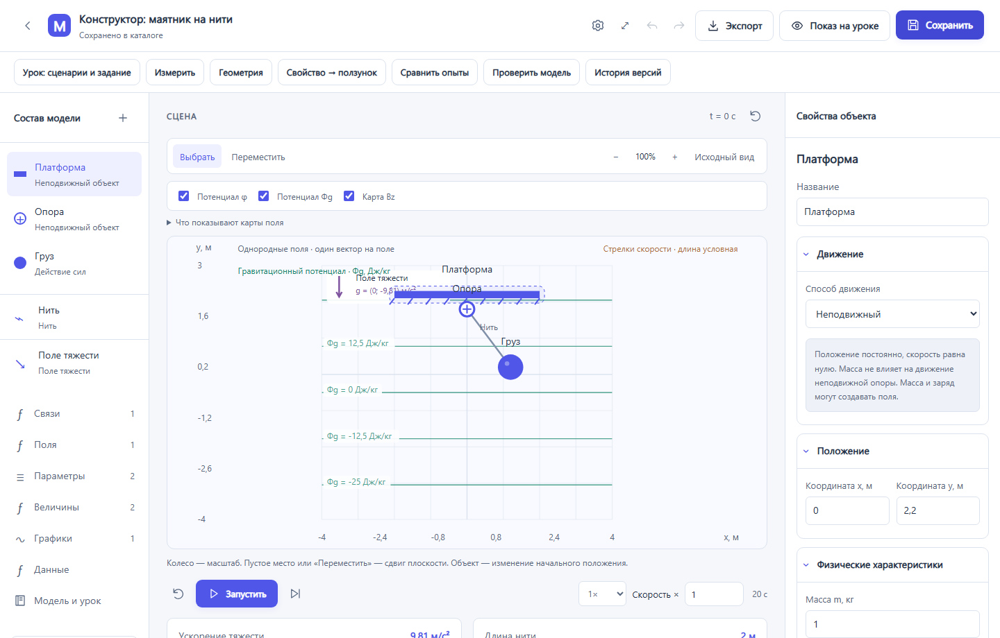
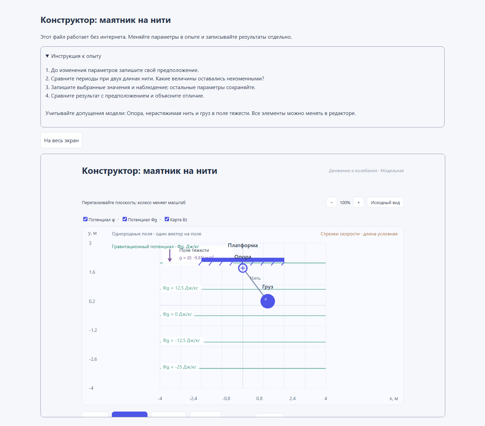

<p align="center">
  
</p>

<h1 align="center">Модельная</h1>

<p align="center">
  Интерактивная лаборатория по физике и математике.<br>
  Создавайте опыты, исследуйте данные и передавайте ученикам один HTML.
</p>

<p align="center">
  <a href="https://github.com/sashasychev05-sketch/model-studio/releases/tag/v2.4.0"></a>
  <a href="https://github.com/sashasychev05-sketch/model-studio/actions/workflows/check.yml"></a>
  
  
</p>

<p align="center">
  <a href="https://github.com/sashasychev05-sketch/model-studio/releases/download/v2.4.0/ModelStudio-Setup-2.4.0-x64.exe"><strong>Скачать для Windows · 2.4.0</strong></a>
  · <a href="docs/GUIDE.md">Руководство</a>
  · <a href="docs/VERSION-2.4.md">Что нового</a>
  · <a href="docs/ROADMAP.md">План развития</a>
</p>


**Модельная** — отдельное приложение для учителя и самостоятельных экспериментов. В комплекте **20 готовых моделей: 10 по физике и 10 по математике**. Можно менять параметры, собирать собственные сцены, создавать HTML-модели и анализировать измерения. После установки работа с опытами не требует интернета.

## Скачать и начать

**[Установщик 2.4.0 для Windows x64](https://github.com/sashasychev05-sketch/model-studio/releases/download/v2.4.0/ModelStudio-Setup-2.4.0-x64.exe)** · [Все выпуски](https://github.com/sashasychev05-sketch/model-studio/releases)

1. Скачайте и запустите установщик. Он создаёт ярлыки для текущего пользователя; права администратора не нужны.
2. Откройте **Модельную** и выберите опыт в каталоге.
3. Для собственного варианта нажмите **⋯ → Создать копию**, измените параметры и сохраните модель.
4. Чтобы передать опыт ученику, выберите **Экспорт → Подготовить опыт для ученика**, проверьте предпросмотр и скачайте HTML.

Программа открывается отдельным окном. Установка Node.js, терминал и браузер для запуска Windows-приложения не нужны. Ученику достаточно открыть полученный HTML в современном браузере: приложение, сервер и интернет ему не требуются.

Обновления: **⚙ Настройки приложения → Проверить обновления**. Скачивание и установка требуют подтверждения; библиотека хранится отдельно от программы. Установщик пока без цифровой подписи Windows. [Установка, обновления, данные и ZIP-сборка](docs/DESKTOP.md).

## Что нового в 2.4

Выпуск от **10 октября 2026**:

- **Общие настройки за шестерёнкой:** шесть тем, панели, навигация каталога, резервные копии, перенос библиотеки, обновления и справка.
- **Полный экран:** кнопка в интерфейсе, F11 и Esc в Windows-приложении.
- **Перенос прежней библиотеки:** выбор папки, проверка состава, перенос моделей, истории и анализа с сохранением исходной папки и прежней библиотеки.
- **Удобнее анализ таблиц:** обычный JSON, подсказки импорта и автоматический пересчёт сохранённого графика.
- **HTML для ученика:** редактируемая инструкция и предпросмотр именно того файла, который будет скачан.
- **Мелкие удобства:** понятные имена экспортов, «Показать в папке», видимые ошибки форм, горячие клавиши и окно «О приложении». Исправлена ошибка при закрытии окна приложения.

[Подробности 2.4](docs/VERSION-2.4.md) · [История выпусков](docs/RELEASE.md)

## Возможности

| Для чего | Что доступно |
| --- | --- |
| Провести урок | Готовые физические и математические опыты, параметры, анимация, режим показа на уроке и полный экран |
| Создать свою модель | Конструктор объектов, формул, нитей, пружин и полей; геометрические построения; отдельный HTML-редактор |
| Исследовать измерения | CSV/TSV/JSON, предпросмотр, статистика, графики, гистограммы, сравнение с расчётом и подбор до трёх параметров |
| Организовать работу | Поиск, папки, фильтры, история сохранений, сравнение опытов, сценарии и задания |
| Поделиться | Редактируемый JSON, автономный HTML, PNG и CSV для сцен конструктора |
| Сохранить библиотеку | Явное сохранение анализа, резервная копия с историей, проверяемое восстановление и перенос старой папки |





Начните с **маятника**, **гравитационного туннеля**, **двух тел с пружиной**, **электромагнитной волны**, **параллелограмма**, **Байеса** или **Монте-Карло**. [Все модели и идеи опытов](docs/MODELS.md).

## Ваши данные

В Windows библиотека находится в **%APPDATA%/Модельная/library**. Обновление программы сохраняет модели и анализ. Перед переносом или восстановлением сохраните текущую работу и скачайте копию через **⚙ → Резервная копия**.

Копия содержит папки, модели, историю и сохранённый самостоятельный анализ. Восстановление сначала проверяет файл и показывает его состав, а прежнюю библиотеку сохраняет рядом. Несохранённые черновики и настройки внешнего вида в копию не входят. [Подробная инструкция](docs/DESKTOP.md).

## Документация и помощь

| Раздел | Ссылка |
| --- | --- |
| Работа с приложением | [Руководство пользователя](docs/GUIDE.md) |
| Готовые опыты | [Каталог моделей](docs/MODELS.md) |
| Установка и обновления | [Windows, резервные копии и перенос](docs/DESKTOP.md) |
| Таблицы и расчёты | [Руководство анализа](docs/SCIENCE-STAGE-1.md) |
| Изменения | [Выпуск 2.4](docs/VERSION-2.4.md) · [История](docs/RELEASE.md) |
| Следующие версии | [План развития](docs/ROADMAP.md) · [Новые объекты и свойства редактора](docs/EDITOR-NEXT.md) |
| Участие в разработке | [Как предложить изменение](CONTRIBUTING.md) · [Архитектура](docs/DEVELOPMENT.md) |

Руководство и описание текущей версии также открываются внутри приложения без интернета: **⚙ → О приложении**.

Нашли ошибку или есть идея? [Создайте issue](https://github.com/sashasychev05-sketch/model-studio/issues/new/choose). Для ошибки укажите версию, шаги воспроизведения и ожидаемый результат.

## Запуск из исходников

<details>
<summary>Браузерная версия · Windows, Linux и macOS</summary>

Нужен **Node.js 22.13 или новее** с [nodejs.org](https://nodejs.org/). Скачайте репозиторий через **Code → Download ZIP** или клонируйте его.

В Windows можно открыть **ЗАПУСТИТЬ-В-БРАУЗЕРЕ.cmd**. На любой системе выполните в папке репозитория:

```sh
node server.mjs
```

Откройте **http://127.0.0.1:4189/**. Терминал должен оставаться открытым; остановка — Ctrl+C. Для этого запуска установка пакетов не нужна: научные библиотеки уже включены.

При первом запуске примеры из gallery/ копируются в новую папку data/. Последующие запуски сохраняют правки. Папка data/ исключена из Git; её можно перенести через настройки приложения.

Нужен современный браузер с ES modules, module Worker и Web Crypto. Автоматические проверки выполняются в Chromium на Windows/Linux; Firefox и Safari отдельно не проверялись. Готовый установщик выпускается только для Windows x64.

</details>

<details>
<summary>Разработка и автоматические проверки</summary>

```sh
pnpm install --frozen-lockfile --ignore-scripts
node --test tools/*.test.mjs
node tools/check-gallery.mjs
pnpm exec playwright install chromium
pnpm test:browser
```

Для запуска и сборки отдельного Windows-приложения:

```sh
node node_modules/electron/install.js
pnpm desktop
pnpm test:desktop
pnpm package:installer
```

Проверки охватывают Node, галерею, Chromium, исходное и собранное Electron-приложение, автономный HTML, загрузку обновления и сохранность анализа при установке, обновлении и удалении. Установочные тесты выполняются на одноразовом Windows runner. [Проверки GitHub Actions](https://github.com/sashasychev05-sketch/model-studio/actions/workflows/check.yml).

[Архитектура](docs/DEVELOPMENT.md) · [Правила работы с кодом](AGENTS.md) · [Научные интеграции](docs/SCIENTIFIC-INTEGRATIONS.md)

</details>

## Границы моделирования

Движущиеся объекты конструктора — материальные точки. Универсальные столкновения, физическое вращение, автоматическая проверка размерностей и полный решатель Максвелла пока не реализованы. Каждый урок описывает формулы и допущения; предложения новых объектов приведены отдельно в плане развития.

Приложение работает локально и слушает только loopback. Это лаборатория на компьютере пользователя; общий сервер с учётными записями требует отдельной реализации.
