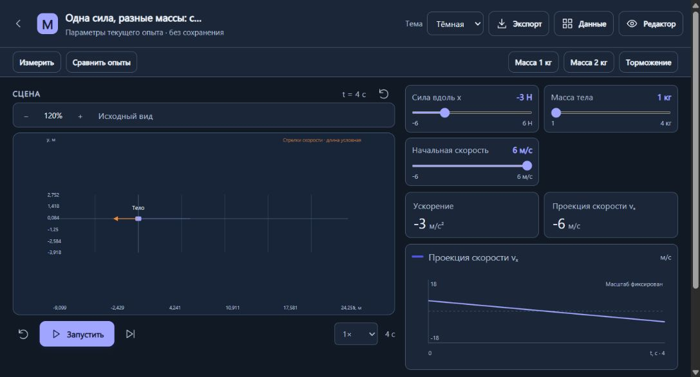
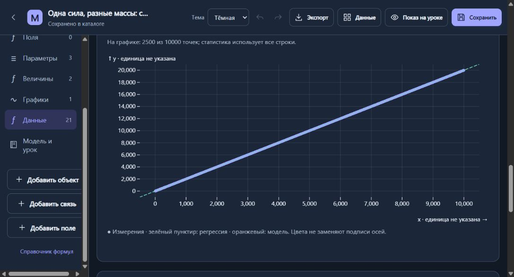

# Первый этап научных интеграций — версия 2.1

Выполнено 8 октября 2026 года по [ТЗ](SCIENTIFIC-INTEGRATIONS.md): F1, F2, F3 и необходимая часть F7. Awesome используется как указатель на библиотеки; код самого списка в приложение не встраивается.

## Что добавлено

В конструкторе появилась вкладка **Данные**. CSV/TSV → предпросмотр → таблица → статистика → график → сравнение с моделью. Можно записать величину собственного расчёта в таблицу, подобрать параметры и явно применить результат. Сохранение данных с моделью выполняется отдельной кнопкой. Галерея осталась в пределах 20 моделей.

Импорт поддерживает UTF-8 и Windows-1251, BOM, кавычки, переносы внутри ячеек, заголовки, разделители и десятичную запятую. Лимиты: 5 MiB, 50 000 строк, 20 колонок; предпросмотр — 20 строк. Числовой тип предполагается при не менее 60% корректных непустых чисел; его можно изменить вручную. Названия, единицы и роли колонок редактируются. Короткая строка дополняется null; лишние ячейки и повреждённые кавычки отклоняются. Ошибки показывают физический номер строки. Первые 100 диагностик сохраняются.

Пустая ячейка — null. Некорректное число — null с отдельным счётчиком и диагностикой. Нули остаются нулями. Статистика колонки использует все конечные числа; регрессия и сравнение используют полные пары. Среднее, медиана, минимум, максимум, дисперсия, стандартное отклонение, Q1/Q3, линейная регрессия, Pearson r и R². Выборочная дисперсия делится на n−1, генеральная — на n. При n=1 выборочная дисперсия не определена. Квартили — Hyndman–Fan 7, линейная интерполяция; для [1,2,3,4] Q1=1,75, Q3=3,25. Постоянный x не имеет наклона регрессии; постоянный y не имеет стандартного r/R².

На одном графике показываются данные, линия регрессии и расчётная кривая. Есть абсолютные и относительные остатки, RMSE и MAE. Относительный остаток равен (данные−модель)/|модель|; при нуле или переполнении не определён. Единицы обеих осей объявляются явно и должны совпадать с объявленными единицами модели. Автоматической конверсии и проверки размерности AST на этом этапе нет. Колонка времени должна иметь единицу s/с и лежать в пределах длительности модели. Для неё доступны t и переменные тел, например body_x; применяется текущий физический интегратор. Для иных координат используется x.

Подбор: до 3 параметров и 5 000 полных пар; ограниченный покоординатный поиск минимума RMSE, не более 160 итераций, относительный порог шага 10⁻⁷ от диапазона. Начальные значения и границы задаются вручную внутри диапазонов параметров. Результат показывает сходимость, достижение границ и допущения. Он не меняет модель до кнопки **Применить**. Одна операция Undo возвращает прежние параметры. Глобальный минимум, уникальность параметров и доверительные интервалы не обещаются.

Области графиков и остатков фиксируются после первого расчёта. Изменение параметров их не подбирает заново; для этого есть отдельная кнопка. Смена анализируемых осей или вида графика начинает новую область. Гистограмма использует явно рассчитанные интервалы: [левая, правая), последний включает правую границу. Значения вне фиксированной области подсчитываются, но остаются в статистике. Для точек/кривых отображается максимум 2 500 равномерно выбранных отсчётов; статистика использует полный набор.

## Локальные библиотеки и вычисления

| Пакет | Версия | Лицензия | Использование |
| --- | --- | --- | --- |
| Papa Parse | 5.7.0 | MIT | CSV/TSV и безопасный CSV-экспорт |
| Simple Statistics | 7.12.1 | ISC | Описательная статистика, регрессия, корреляция |
| Observable Plot | 0.6.17 | ISC | Точки, кривые, гистограммы, остатки |
| esbuild | 0.25.12 | MIT | Только сборка для разработчика |

Проверены официальные исходники установленных версий. Локальные сборки, SHA-256, размеры и транзитивные лицензии включены в [manifest.json](../web/vendor/manifest.json) и [licenses](../web/vendor/licenses/). Суммарный gzip-размер двух runtime-сборок — 103 354 байта, примерно 101 KiB, при бюджете ТЗ 500 KiB. Реальный сервер отдаёт файлы без gzip; это около 293 KiB исходных минифицированных JS. Обычному пользователю не требуется установка npm-пакетов или CDN.

Адаптер statistics-js/1 допускает только известные операции. Module Web Worker выполняет разбор, статистику, запись расчёта и подбор. Новый запрос завершает предыдущий worker; очередь содержит только актуальный запрос. **Отмена** и timeout 30 с действительно завершают вычислительный процесс. jobId, ревизия и состояние модели защищают от запоздалых результатов. При изменении данных или модели старый результат убирается. Исходный File сохраняется: передаваемый ArrayBuffer можно заново прочитать при повторном импорте. Произвольный код, внешние URL и установка пакетов из данных не поддерживаются.

## Сохранение и обмен

Необязательная секция analysis/schemaVersion=1 содержит одну таблицу и конфигурацию анализа: роли, единицы, источник, SHA-256, политику пропусков, метод, seed/версию генератора, фиксированные области, выражение и настройки подбора. Старые JSON-модели работают без analysis. Эта секция доступна только нативному конструктору; HTML-уроки сохраняют прежнюю изоляцию.

Экспорт анализа JSON содержит данные, конфигурацию, результат и provenance; его можно импортировать через кнопку импорта вкладки Данные. При импорте используются только проверенные данные/настройки, присланные результаты не считаются доверенными и пересчитываются. Экспорт всей модели JSON сохраняет редактируемую сцену вместе с analysis. CSV защищает текстовые формулы для табличных редакторов, сохраняет отрицательные числа и пустые ячейки. HTML-отчёт содержит графики, таблицу и JSON и явно помечен **«Снимок анализа. Пересчёт недоступен»**. Автономный HTML нативной модели включает снимок сохранённого анализа; сама сцена продолжает работать офлайн. Лимит сохранённой таблицы — 12 MiB, HTTP/JSON — 16 MiB.

## Три воспроизводимых опыта

1. **Второй закон Ньютона**: 21 синтетическое измерение x(t)=1,5t² с небольшим шумом. В модели Ньютона при массе 1 кг и v₀=0 подбор силы даёт около 3,009 Н, RMSE около 0,02236 м. При иных начальных условиях результат и остатки закономерно меняются.
2. **Среднее и выброс**: 21 наблюдение, последнее равно 35; сравниваются устойчивость медианы и чувствительность среднего.
3. **Корреляция и совпадение**: 101 наблюдение, связанная и независимая колонка Y; коэффициент корреляции не трактуется как причинность.

Seed=314159; LCG32 (a=1664525, c=1013904223), версия 1. Это синтетические наборы, а не реальные измерения. Открытие набора не меняет параметры сцены и не сохраняет таблицу автоматически.

## Исправления по замечаниям к показу

- Ньютон: отрицательная сила, ползунок начальной скорости, сценарий **Торможение**, общая шкала vₓ от −18 до 18 м/с. При F=−3 Н, m=1 кг, v₀=6 м/с остановка через 2 с; далее постоянная сила меняет направление движения.
- На широком экране сцена, ползунки, показания и график расположены рядом. SVG сохраняет одинаковый масштаб x/y. На узком экране применяется последовательная компоновка с прокруткой.
- Задания и фразы «предскажите» убраны из показа преподавателя и автономных демонстраций. Существующие задания можно редактировать в конструкторе, сохранённые проекты не теряют их текст.
- Источники гравитации настраиваются в свойствах объектов. Нерелевантные карты полей не показываются в демонстрации. Флажки заряженных частиц сохранены для профильных физических опытов.
- Декоративные линии больше не дублируют подпись «Линия на рисунке».

## Проверки и обнаруженные ошибки

[Полный отчёт](test-results.txt): 137 тестов, 137 проходят; [галерея](gallery-check.json): 20 моделей, 10 физических и 10 математических. Проверены CSV, крайние статистические случаи, аналитическая регрессия, законы движения при торможении, нативный подбор, границы, round-trip JSON, безопасный экспорт, отмена worker, контрольные суммы, локальные HTTP-модули и сохранение таблицы более прежнего лимита 250 kB. Физические проверки прежнего движка также проходят; это не сертификация любых пользовательских формул.

Браузерная проверка Chromium в Codex: запуск/остановка торможения, отсутствие лишних полей в показе, расчёт/графики, подбор силы, явное применение и Undo, метаданные колонок, сохранение/перезагрузка, предпросмотр CSV, пропуски/ошибки. Таблица 10 000×5: регрессия y=2x+1, r=1, R²=1; статистика использует все строки, график — 2 500 точек. Проверены JSON/HTML-отчёты и автономный экспорт со снимком сохранённого анализа: несохранённая таблица в интерфейсе остаётся прежней. На ширине 390 px нет горизонтального переполнения страницы; смена темы сохраняет таблицу и позволяет пересчитать статистику. Отдельные проверки браузеров Firefox/Safari не выполнялись; требуются ES modules, module Worker, Web Crypto и современный SVG.

Найден и исправлен путь /web/vendor/statistics.js: без маршрута сервер возвращал 404, и приложение оставалось на «Открываем каталог…». Маршрут покрыт HTTP-тестом. Метаданные теперь обновляются при вводе, поэтому немедленное нажатие Сохранить сохраняет новую подпись. Исправлены автоподбор шкалы гистограммы, проверка отдельной шкалы остатков при смене вида графика, переполнение относительного остатка и применение устаревшего результата подбора. Экспорт сохранённого анализа использует отдельный объект отчёта и не заменяет текущую несохранённую таблицу. Раскрытое состояние формы импорта сохраняется после пересчёта. Сохранённые результаты не заменяют пересчёт после изменения входов.

[Замер вычислительного ядра](science-benchmark.json): 10k×5 — около 62 мс, 50k×5 — около 211 мс на указанном CPU/Node. Это тёплый запуск в Node, без загрузки worker, передачи сообщений и рисования браузера; RSS-дельта не равна пиковому потреблению. Результаты не распространяются на слабые компьютеры.

Проверка [pnpm audit](science-audit.json) для закреплённого lockfile на указанную дату не обнаружила advisories. Это состояние базы предупреждений на момент проверки, а не гарантия отсутствия уязвимостей.

Дополнительно: загрузчик показывает ошибку модуля вместо бесконечной плашки; история Undo разделяет неизменяемые строки таблицы и отдельно копирует настройки; подбор и запись расчёта не клонируют секцию analysis на каждом вычислении; переименование сохраняет ссылки выражения и списка подбора.

## Что осталось следующему этапу

math.js для конверсии/AST-размерностей и матриц; SymPy/Pyodide/SciPy и отдельные численные решатели; реальные измерительные погрешности, доверительные интервалы и взвешенный подбор; большие наборы/потоковое хранение и пакетный экспорт. На этапе 1 отсутствует общий сервер, произвольные скрипты и новый физический движок. Ограниченный поиск может найти несколько равноценных решений; пользователь должен оценить остатки и допустимость модели.
